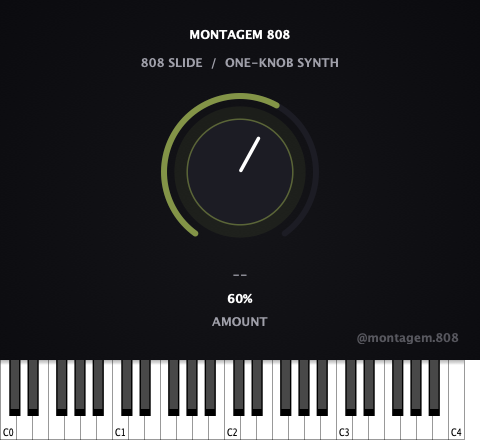

# Montagem 808

**A one-knob 808 slide synth, the instrument at the front of the [Montagem](https://github.com/nabsei/montagem-finisher) chain.**

Play a note, get a classic 808 slide — pitch gliding down from above the
root into the note itself, with a punchy attack and natural decay. Generate
the 808 here, then finish it with Montagem Finisher (drive/loudness),
Widener (space), and Punch (transient). Built with [JUCE](https://juce.com/),
ships as VST3 / AU / Standalone on macOS and Windows.

<p align="center">
  
</p>

<p align="center">
  <strong><a href="https://github.com/nabsei/montagem-808/releases/latest">⬇ Download the latest beta</a></strong> — macOS and Windows, free.
</p>

## Why one knob

Same philosophy as the rest of the Montagem chain: one macro parameter, no
configuration. `Amount` drives the glide range, glide time, decay length,
and oscillator tone together, so there's no attack/decay/glide-time/tone
matrix to fight with — just one knob that goes from tight and short to
deep and long.

## Status

Early-stage / actively developed public beta.

This repository shows the plugin's **architecture**: JUCE plugin wrapper,
MIDI/voice handling, custom UI, parameter handling, state save/load. The
exact synthesis calibration used in the shipped/tested build (glide range,
decay curve, oscillator blend) is simplified in `Source/E808Processor.cpp`
here — that tuning is the actual product, not open source at this stage.

## Features

- Single macro parameter (`Amount`) driving glide, decay, and tone together
- Monophonic 808-slide voice: pitch glides from above the played note down
  into it, matching the classic genre-standard shape
- **Built-in on-screen keyboard** — JUCE's standalone wrapper doesn't
  provide one, so this ships its own, playable by mouse click with no MIDI
  controller required
- Live note-name display reacting to whatever note is currently sounding
- Explicit stereo-only bus layout — found and fixed a real crash during
  development where an unsupported (mono) layout request segfaulted the
  AU, caught by running `auval` rather than assuming it would pass
- Denormal-safe processing and parameter smoothing (no zipper noise)
- Builds as **VST3**, **AU** (passes `auval` validation), and a **Standalone** app

## Tech stack

- C++17, [JUCE](https://github.com/juce-framework/JUCE) (audio processing + UI)
- CMake + Ninja

## Building

```bash
git clone --depth 1 https://github.com/juce-framework/JUCE.git libs/JUCE
cmake -B build -G Ninja -DCMAKE_BUILD_TYPE=Release
cmake --build build
```

On macOS, add `-DCMAKE_OSX_ARCHITECTURES="arm64;x86_64"` to the configure step
to build a universal binary (Apple Silicon + Intel) instead of the host-only
default. The official beta releases are built this way.

## Project structure

```
Source/
  PluginEntry.cpp        JUCE plugin entry point
  E808Processor.*         AudioProcessor: MIDI/voice handling, DSP, state save/load
  PluginEditor.*           Custom UI (rotary knob, on-screen keyboard, layout)
  E808LookAndFeel.h        Custom LookAndFeel for the rotary control
CMakeLists.txt
```

## Open items

- [ ] Code signing / notarization for both macOS and Windows (current
      beta requires a one-time manual step on first install)
- [ ] Polyphony (currently monophonic, matching how 808 basslines are
      typically programmed -- one note at a time)
- [ ] Automated test suite

## License

**This repository's source code:** MIT — see [LICENSE](LICENSE). Covers
the architecture shown here (JUCE plugin wrapper, UI, build setup). As
noted above, the synthesis calibration used in the actual product is not
included in this source.

**The compiled plugin (downloads / releases):** All rights reserved —
free to use, not free to redistribute or resell. See the `TERMS.txt`
included in each release download for the full terms.
